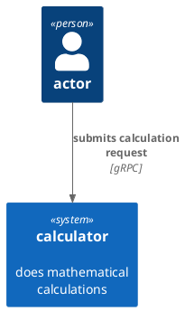
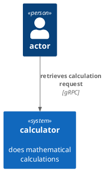
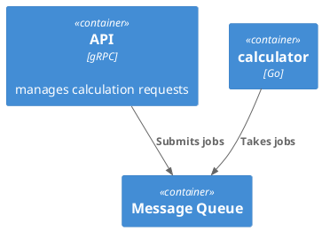
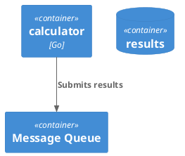
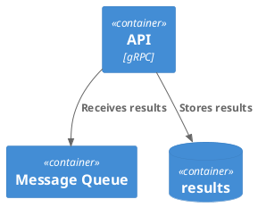

# calculator

Calculator is a demo project to show how I might build a service in Go.

The idea is for a client to send calculations to a gRPC server. The server
should distribute the calculations as jobs. We'll just pretend they're
heavy-duty calculations for now.

Because some calculations might take a while, a user will get a job ID back and
be able to retrieve it later.

The calculator has two major components: the API (in gRPC) and the calculators,
which are the workers. The API can send the calculation requests to any number
of workers, but only one of them will pick up a job at a time.

When a calculation is complete, the worker will send the result back to the API.

<!-- reminder: I need to scrub expired results -->

The API will follow up by storing the result for retrieval.

## Running

## Building

## Deploying to Docker

## Generating Protos

Run `make proto` to regenerate the protos.
