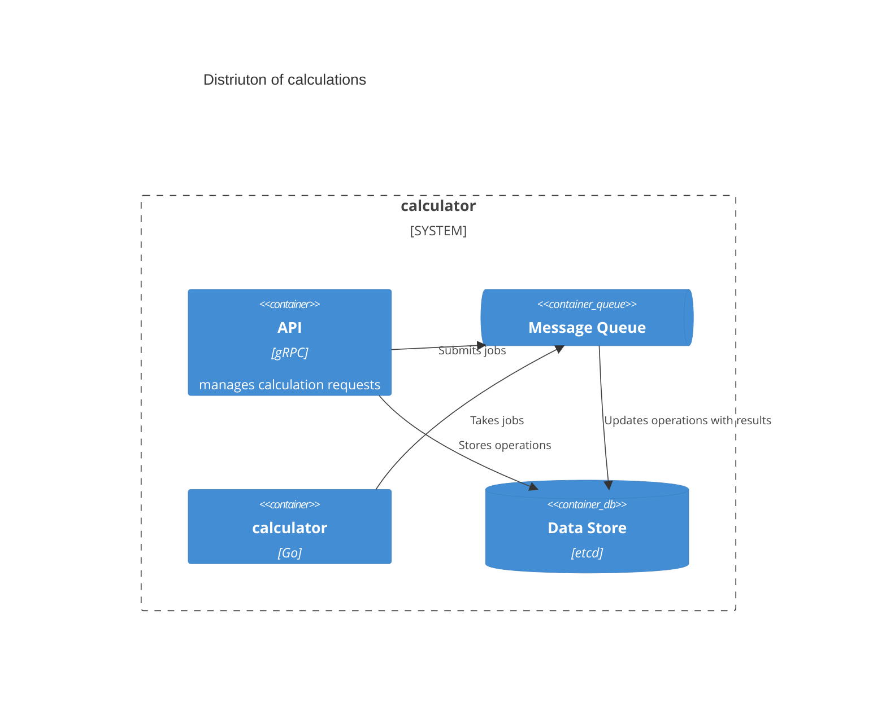

# calculator

Calculator is a demo project to show how I might build a service in Go.

The idea is for a client to send calculations to a gRPC server. The server
should distribute the calculations as jobs. We'll just pretend they're
heavy-duty calculations for now.


Because some calculations might take a while, a user will get a job ID back and
be able to retrieve it later.


The calculator has two major components: the API (in gRPC) and the calculators,
which are the workers. The API can send the calculation requests to any number
of workers, but only one of them will pick up a job at a time.



## Running

To run the daemon locally:

```shell
CALCULATORD_RABBIT_USER=guest CALCULATORD_RABBIT_PASS=guest ./calculatord
```

To run the worker locally:

```shell
CALCULATORW_RABBIT_USER=guest CALCULATORW_RABBIT_PASS=guest ./calculatorw
```

To use grpcurl,

```shell
grpcurl -d 'todo' \
    -plaintext \
    -proto proto/calculator.proto \
    -import-path $(pwd)/proto \
    -import-path $(pwd)/proto/third_party/googleapis \
    localhost:8080 calculator.Calculations/FibonacciOf
```

## Building

To build the daemon:

```shell
make calculatord
```

## Deploying to Docker

## Generating Protos

Run `make proto` to regenerate the protos.
